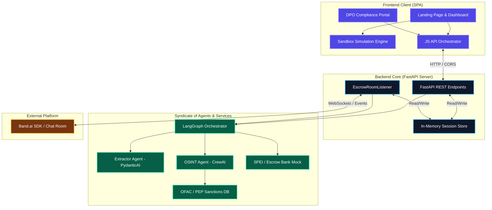

# EscrowGuard - Multi-Agent Compliance System for High-Value Escrows

## 🏢 Developed by **Script Hunters** for the **Band of Agents** Hackathon 🚀

EscrowGuard is an intelligent, secure multi-agent platform designed to mitigate and resolve operational friction caused by false positives in regulatory compliance checks (OFAC, PEP, and Anti-Money Laundering) in high-value escrow financial transactions.

This repository is organized with a decoupled **Frontend / Backend** architecture to support independent deployments and a modular design suitable for production scaling.

---

## 🛠️ Complete System Architecture

EscrowGuard integrates autonomous and cooperative LLM agents, a secure state machine (LangGraph), simulated banking services, and an interactive compliance officer (DPO) portal into a unified ecosystem:



---

## 📁 Project Directory Structure

The workspace is segmented to separate the user interface from backend processing engines in Python:

```text
escrow-guard/
├── docs/                               # Technical specifications and scripts
│   ├── dev1_integration.md             # Integration & FastAPI API Specification
│   ├── dev3_extractor_integration.md   # Extractor Agent Specification (PydanticAI)
│   ├── dev6_frontend_simulator.md      # Simulator and visual layout specification
│   ├── demo_script_es.md               # Step-by-step demo script (Spanish)
│   └── demo_script_en.md               # Step-by-step demo script (English)
├── frontend/                           # Client web application (Dev 6)
│   ├── index.html                      # Landing Page & Sandbox Simulator
│   ├── index.css                       # Refined Glassmorphic stylesheet for the simulator
│   ├── login.html                      # Compliance portal login view for DPO
│   ├── dashboard.html                  # Interactive DPO dashboard for escrow auditing
│   └── portal.css                      # Dedicated stylesheets for compliance portal interfaces
├── backend/                            # Python Backend Server
│   ├── main.py                         # FastAPI REST API & Band.ai Listener (Dev 1)
│   ├── requirements.txt                # Python backend dependencies
│   ├── .env.example                    # Template for required environment variables
│   ├── agents/                         # AI Syndicate Agents
│   │   ├── __init__.py
│   │   ├── extractor.py                # Biometric PDF Extractor (PydanticAI - Dev 3)
│   │   ├── osint.py                    # OSINT Web Investigator (CrewAI/LiteLLM - Dev 4)
│   │   └── escrow.py                   # State Graph Orchestrator (LangGraph - Dev 5)
│   ├── services/                       # Simulated services and integrations (Dev 2)
│   │   ├── __init__.py
│   │   ├── bank_mock.py                # Banxico SPEI & Escrow Mock Bank
│   │   └── sanction_mock.py            # OFAC sanctions & PEP mock database
│   └── mock_docs/                      # Sample documents and test payloads (Dev 2)
│       ├── README.md                   # Guide for using test documents
│       ├── cliente_limpio.pdf          # Clean passport (Approved automatically)
│       ├── solicitud_sat.pdf           # Suspicious passport (Triggers Alerta / False Positive)
│       ├── empresa_fantasma.pdf        # Blocked passport (Triggers rejection)
│       ├── Pasaporte (1).pdf           # Additional sample passport
│       └── sample_payloads.json        # JSON containing sample API request payloads
├── LICENSE                             # Project license
└── README.md                           # Main repository documentation
```

---

## 👤 Developer Roles and Deliverables

The **EscrowGuard** project was collaboratively developed by distributing the technical scope across 6 specialized roles:

### 🛠️ Dev 1: API Integration, Listener & SDK Core
* **Responsibilities:**
  - Designed the **FastAPI** backend with dynamic CORS configuration for cross-origin frontend communication.
  - Implemented REST endpoints: `POST /api/simulate`, `GET /api/transaction/{id}`, and `POST /api/transaction/{id}/resolve`.
  - Integrated the real-time chat room listener using the **Band Pro SDK**, facilitating automated alert distribution and interactive human feedback command consumption (`APROBAR` / `RECHAZAR`).

### 💰 Dev 2: Simulation Services & Document Assets
* **Responsibilities:**
  - Programmed the mock banking logic (`bank_mock.py`), supporting preventive locks, SPEI refunds, and final release to the seller.
  - Engineered the sanctions database mock (`sanction_mock.py`) referencing the OFAC/PEP lists.
  - Authored realistic sample PDF passports and payloads for Clean, False Positive, and Critical Risk validation testing.

### 🔍 Dev 3: Biometric Compliance Extractor Agent
* **Responsibilities:**
  - Developed the structured text extractor using **PydanticAI** and **PyPDF2** to convert raw PDF contents into type-safe `EntidadesExtraidas` data models.
  - Built static fallback matchers based on filename patterns to ensure resilient execution when LLM access is unavailable.
  - Designed robust handling for dynamic environment variables to avoid runtime exceptions.

### 🌐 Dev 4: Financial OSINT Investigator Agent
* **Responsibilities:**
  - Configured the intelligent agent in **CrewAI** to perform web searches for adverse news, PEP records, and UIF warnings.
  - Integrated **LiteLLM** and Gemini API (2.5 Flash / 3.5 Flash) with Groq fallbacks as cognitive engines for the agent.
  - Formatted final reports in Markdown to render clean, readable intelligence reports.

### ⛓️ Dev 5: State Machine Orchestrator
* **Responsibilities:**
  - Implemented the transition state machine using **LangGraph** to model the escrow business logic.
  - Managed the transaction life-cycle across nodes: *Extraction*, *Bank Hold*, *OSINT Check*, *Compliance Hold (DPO)*, and *Settlement/Release*.
  - Configured paused states to support asynchronous Human-in-the-Loop (HITL) manual resolution.

### 🎨 Dev 6: Web Simulator UX & Compliance Portals
* **Responsibilities:**
  - Crafted a premium glassmorphic Single Page Application under the visual guidelines of the Stitch Design System.
  - Programmed a dual-mode engine (Local **Sandbox** client simulation / Local **Live** FastAPI server connection).
  - Designed drag-and-drop file imports, real-time SVG status highlights, and dedicated DPO portal views (`login.html` and `dashboard.html`).

---

## 🚀 Local Setup & Run Instructions

### 1. Starting the Backend
1. Navigate to the backend folder:
   ```bash
   cd backend
   ```
2. Create your environment variables file `.env` using `.env.example` as a template:
   ```bash
   cp .env.example .env
   ```
   Ensure you configure the following keys:
   * `GEMINI_API_KEY` (Used by LiteLLM / Gemini 2.5 Flash)
   * `GROK_API_KEY` (Optional, mapped to initialize Groq in CrewAI)
   * `BAND_API_KEY` and `BAND_ROOM_ID` (Optional, required if connecting a bot to active Band.ai chatrooms)

3. Activate your virtual environment and install dependencies:
   ```bash
   source ../.venv/bin/activate
   pip install -r requirements.txt
   ```
4. Run the FastAPI server:
   ```bash
   python main.py
   ```
   The backend will start and run on [http://localhost:8000](http://localhost:8000).

### 2. Starting the Frontend
1. Navigate to the frontend folder:
   ```bash
   cd ../frontend
   ```
2. Start a static local server to prevent CORS issues:
   ```bash
   python3 -m http.server 8080
   ```
3. Open [http://localhost:8080](http://localhost:8080) in your web browser.
4. Access the DPO compliance portal views by opening `login.html` and `dashboard.html` directly in your local environment.
