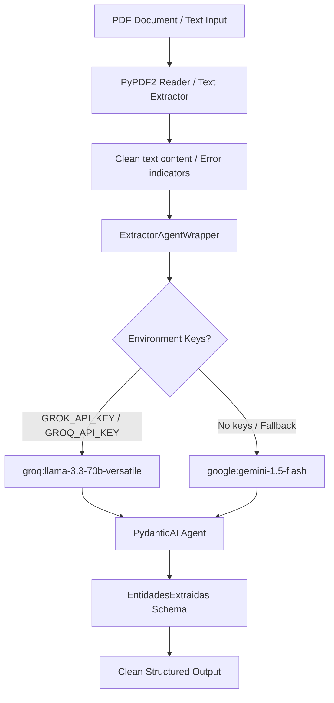

# Technical Specification for Extraction Agent & LLM Routing (Dev 3)

## 🏢 Script Hunters - EscrowGuard

This document details the technical specification for the document extraction phase (extractor agent) of **EscrowGuard**. It covers the PydanticAI agent configuration, the PyPDF2 secure parsing mechanism, the dynamic provider routing (supporting Groq/Grok and Gemini), the environment key mappings, and the integration of our backend as a **Remote Agent** inside the Band.ai platform.

---

## 🛠️ Extraction Phase Architecture

The extractor agent resides in `agents/extractor.py` and is responsible for parsing raw document input (such as PDF files representing passports or incorporation documents) and converting it into a clean, validated JSON structure.



---

## 📋 Data Schema (`EntidadesExtraidas`)

The extraction target is defined using Pydantic v2 in the `EntidadesExtraidas` model, ensuring strict format validation.

| Field Name | Type | Description | Failure Handling / Formatting |
| :--- | :--- | :--- | :--- |
| `nombre_completo` | `str` | Cleaned and properly capitalized name of the document holder. | noise/OCR artifacts removed |
| `fecha_nacimiento` | `str` | Standardized birthdate in `YYYY-MM-DD` format. | Returns `"NO_DETECTADO"` if missing or ambiguous |
| `numero_documento` | `str` | Passport or national ID number. | Returns `"NO_DETECTADO"` if missing |
| `nacionalidad` | `str` | Country of origin in **UPPERCASE** (e.g. `MEXICO`, `ESPAÑA`). | Returns `"NO_DETECTADO"` if missing |
| `tipo_documento` | `str` | Type of identity document (e.g. `Pasaporte`, `Identificación Nacional`). | Returns `"NO_DETECTADO"` if missing |

---

## 🔒 PyPDF2 Safe Text Extraction

The `extraer_texto_pdf(pdf_path: str) -> str` function parses PDF files page-by-page. It implements clean exception handling to safeguard the FastAPI server from crashing if a corrupt, encrypted, or missing PDF is referenced:

*   **File existence checks:** Proactively checks if the file exists on the filesystem.
*   **Error trapping:** Catches all reader exceptions and returns a blank string (`""`).
*   **Default LLM routing:** When a blank string or error indicator is passed to the PydanticAI agent, the LLM safely triggers the fallback values, populating fields with `"NO_DETECTADO"`.

---

## 🤖 Dynamic LLM Provider Routing

The extractor is designed to work out-of-the-box with multiple LLM providers depending on the API keys configured in the environment.

1.  **Groq/Grok Integration (Primary):**
    *   **Model:** `groq:llama-3.3-70b-versatile`
    *   **Feature:** High-speed structured data extraction.
2.  **Gemini Integration (Secondary / Default Fallback):**
    *   **Model:** `google:gemini-1.5-flash`
    *   **Feature:** Default development model with high token limits.

### 🔑 Environment Tolerant Mapping
To prevent startup failures caused by variable name discrepancies in `.env` configurations:
*   **Grok to Groq Mapping:** `GROK_API_KEY` (frequently written with a `K` by users) is dynamically mapped to the standard `GROQ_API_KEY` (with a `Q`) at import time.
*   **Gemini to Google Mapping:** `GEMINI_API_KEY` is dynamically mapped to `GOOGLE_API_KEY` to fit PydanticAI's Google model expectations.
*   **Dummy Key Workaround:** If no API keys are present in the environment (e.g., in a clean developer environment), a dummy Google API key is temporarily injected into `os.environ` to allow the FastAPI server to import modules and boot successfully without crashing on startup.

---

## 🔄 Band.ai Remote Agent Integration

EscrowGuard connects to the Band.ai platform using the **Remote Agent** topology. 

### Why Remote Agent instead of Internal Agent?
*   **Internal Agent limits:** An Internal Agent hosted entirely on the Band.ai dashboard cannot execute custom python logic. It cannot read binary files using `PyPDF2`, run state-machine flows in `LangGraph`, execute CrewAI jobs, or talk to mock services.
*   **Remote Agent power:** By configuring the agent as a **Remote Agent** on Band.ai, the platform acts as a gateway. Band.ai forwards chat interactions to our FastAPI server in real time via the SDK client. Our server executes the full Python business logic, triggers the LLM calls (via Groq/Gemini), and posts updates and Human-in-the-Loop decision prompts back to the chat room.

### ⚙️ `.env` Configuration
To bind your local server to the remote agent, configure the following variables in the root `.env` file:

```bash
# LLM Providers API Keys
GEMINI_API_KEY=AIzaSy...
GROK_API_KEY=gsk_...

# Band.ai SDK Connection Credentials
BAND_API_KEY=band_a_1781755417_Kwkw6Ke0TIjP7N7fGjFAzDumqpe-DM2B
BAND_ROOM_ID=1f8c8e3c-74bb-45c7-8729-e914370f10ab
BAND_HANDLE=@avilayael19/escrowguard
```

---

## 🔗 Orchestrator Compatibility Layer (`ExtractorAgentWrapper`)

To prevent breaking existing state machine code in `agents/escrow.py` (which expects a synchronous `run_sync` method returning the model instance directly), `agents/extractor.py` exposes a compatibility class:

```python
class ExtractorAgentWrapper:
    def run_sync(self, input_text_or_pdf_path: str) -> EntidadesExtraidas:
        # 1. Detects if input is a PDF file name or path
        # 2. Resolves path against 'mock_docs' directories
        # 3. Extracts text or passes raw text directly
        # 4. Executes PydanticAI agent.run_sync()
        # 5. Unwraps result.output (for PydanticAI v1.107) and returns the model
```

This ensures that the transition nodes in the state graph can continue using the extractor agent seamlessly:
```python
datos_comprador = extractor_agent.run_sync(archivo)
# datos_comprador is type: EntidadesExtraidas
```
