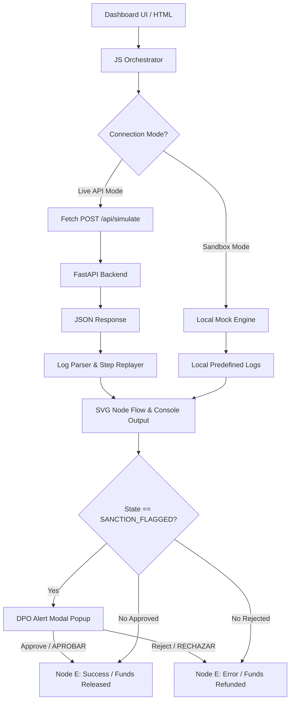

# Technical Specification for Frontend Dashboard & Interactive Simulator (Dev 6)

## 🏢 Script Hunters - EscrowGuard

This document details the technical specification for the user interface, landing page sections, and interactive simulator of **EscrowGuard**. Developed by **Dev 6**, it defines the HTML5/CSS3 architecture, the Stitch Design System alignment, the local/live simulation engines, the SVG node flow animations, and the human-in-the-loop (HITL) compliance modal overlays.

---

## 🛠️ Frontend Architecture

The user interface operates as a single-page application (SPA) client-side client, designed to communicate with the FastAPI backend while providing a self-contained execution fallback.



---

## 🎨 Design System (Stitch Alignment)

The design is built on a **Refined Glassmorphic HUD** (Heads-Up Display) aesthetic, emphasizing technical precision, depth, and security.

### 1. Color Tokens
- **Background Base**: `#0a0a0a` / `#131313` (Pure Night foundations).
- **Primary (Electric Indigo)**: `#6366f1` / `#c0c1ff` (for actions, active lines, and nodes).
- **Secondary (Emerald Success)**: `#10b981` / `#4edea3` (for completed checks and secured funds).
- **Tertiary (Rose Danger)**: `#f43f5e` / `#ffb2b7` (for confirmed alerts and refunds).
- **Warning (Amber Yellow)**: `#fbbf24` (for DPO reviews and human verification stages).

### 2. Layout, Elevation & Depth
- **Sidebar & Header**: Persistent sidebar showcasing real-time monitoring and a top navigation bar.
- **Glassmorphism Panels**: Utilizes semi-transparent surfaces (`rgba(255, 255, 255, 0.03)`) layered over deep backgrounds using `backdrop-filter: blur(12px)` and тон-outlines (`1px solid rgba(255, 255, 255, 0.08)`).
- **Typography**: Headings use `Outfit` (locked-in tracking, heavy weights) and body text uses `Inter`. Monospaced sections use `Fira Code` / `JetBrains Mono` for compliance logs.

---

## ⚙️ Core Components & Simulation Logic

### 1. Dual Simulation Modes
To guarantee compatibility and instant demonstration capabilities, the client integrates two routing mechanisms:
- **Sandbox Mode (Default)**: Runs a client-side javascript simulation engine. It generates mock events, simulates delays, outputs monospaced logs, and transitions nodes locally.
- **Live API Mode**: Performs a real HTTP `POST` request to `http://localhost:8000/api/simulate`. It receives the full backend execution logs and "replays" them step-by-step with visual delays to animate the node changes.

### 2. Preset Scenarios
Three pre-configured presets are available in the UI to autofill the form metadata and showcase different code paths:

| Preset Name | Target File | Expected Backend State | Outcome |
| :--- | :--- | :--- | :--- |
| **Limpio** | `cliente_limpio.pdf` | `APPROVED` | All nodes succeed sequentially; funds are released (Emerald). |
| **Falso Positivo** | `solicitud_sat.pdf` | `SANCTION_FLAGGED` | Flow pauses at DPO node, requesting compliance officer approval. |
| **Sancionado** | `empresa_fantasma.pdf` | `REJECTED` | Auto-rejects at Node C/D, triggering a refund (Rose). |

### 3. Drag & Drop File Zone
Accepts PDF uploads. When a file is dropped or selected, it parses the filename to dynamically load and fill the closest matching preset scenario:
* Filenames with `"limpio"` or `"valido"` load **Limpio**.
* Filenames with `"sospechoso"` or `"sat"` load **Falso Positivo**.
* Filenames with `"fantasma"` or `"sancion"` load **Sancionado**.

### 4. Interactive Node Flow Diagram
Renders five nodes connected by an SVG curved path:
* **Node A: Extractor AI** (PydanticAI text extractor)
* **Node B: Banco Mock** (Locks funds preventively via mock SPEI)
* **Node C: OSINT Risk** (CrewAI OFAC/PEP scan)
* **Node D: Compliance** (HITL human verification gate)
* **Node E: Liberación** (Final dispersals/refunds execution)

The SVG path progress is updated dynamically by altering `stroke-dashoffset` and class states:
- `state-idle`: Default gray border, low opacity.
- `state-loading`: Pulsing blue background, signifying agent processing.
- `state-active`: Glowing scales, representing current focus.
- `state-success`: Steady emerald color, indicating checked-off stage.
- `state-warning`: Flashing amber yellow, alerting DPO review.
- `state-error`: Solid rose red, signifying blocked/refunded state.

### 5. DPO compliance Overlay (HITL)
When Node D transitions to `state-warning`, a modal pops up detailing the suspected homonym match. The compliance officer must review the biometric dates of birth and trigger:
* **Aprobar Falso Positivo (DPO)**: Updates Node D to success and proceeds to Node E (Success: Funds released to seller).
* **Rechazar Depósito**: Updates Node D to error and proceeds to Node E (Error: Funds refunded to buyer).

---

## 🚀 Running & Verification Instructions

1. **Static Serving**: Start a server from the root directory to avoid CORS blockage:
   ```bash
   npx -y live-server
   # or
   python -m http.server 8080
   ```
2. **Sandbox Testing**: Trigger the three presets and review node transitions and terminal logs. Verify that resolving the HITL modal triggers the correct ending node state.
3. **Live API Testing**: With the backend running (`python escrow-guard/main.py`), toggle the mode to **Live API** in the settings. Run a simulation and verify CORS requests hit `/api/simulate` successfully.
